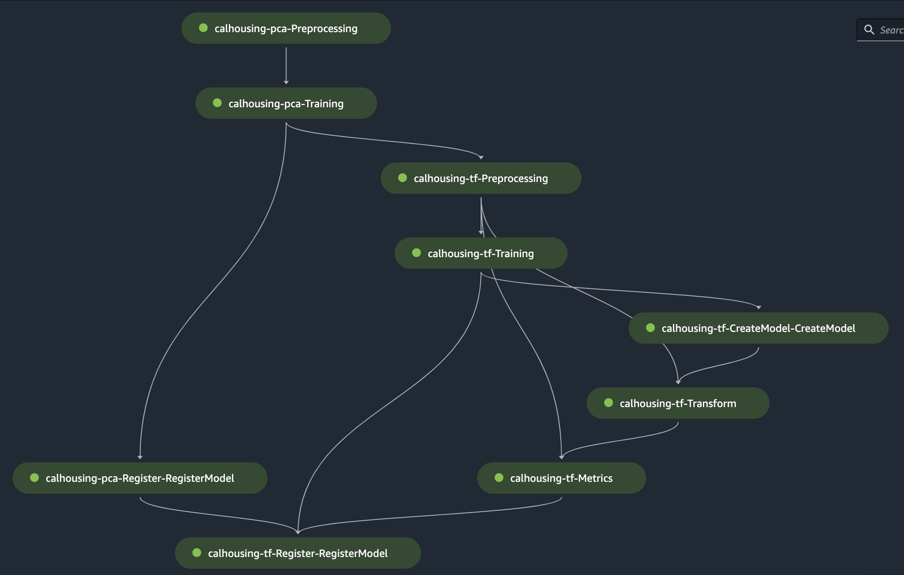

# Welcome to the multi model example for this config driven sagemaker pipeline framwork!

This is an multi model usage example. In this example, there are two models. One is PCA Model trained for feature dimension reduction, the other model is Tensorflow MLP trained for California Housing Price prediction. The Tensorflow Model's preprocessing step uses trained PCA Model to reduce its training data's number of feature dimensions. Also, we add the dependency that Tensorflow Model must be registered after PCA Model registration.



## Multi Model Project Structure

```
/root/
│   dynamic-model-training-with-amazon-sagemaker-pipelines  
│
└───model X specific codebase 
│   │	
│   └─ conf
│   │	│   
│   │	└─multi_model_conf.yaml
│   │	...
│   └─ model_X_scripts
│   │	│
│   │	└─preprocess.py
│   │	│
│   │	└─train.py
│   │	│
│   │	└─...
│
└───model Y specific codebase 
│   │	
│   └─ conf
│   │	│   
│   │	└─multi_model_conf.yaml
│   │	...
│   └─ model_Y_scripts
│   │	│
│   │	└─preprocess.py
│   │	│
│   │	└─train.py
│   │	│
│   │	└─...
```
## Multi Model Runbook
- Step 1: Set Up Anchor Model For Multi Model Execution

For this config driven sagemaker pipeline framwork, when it is used for mutli model pipeline creation, each model will have its own conf.yaml. And the anchor model is define as the model that its conf.yaml contains sagemakerPipeline configuration section. In this example,  the one and only sagemakerPipeline configuration section is defined in cal_housing_tf's conf.yaml file. Any model can be your anchor model.

- Step 2: Set Up Environment Variables

Navigate to project root directory, set up env vars listed in env.env. For this multi model example, you may need to run the following command specifically in terminal.
```
export SMP_MODEL_DOMAIN_CONFIGPATH=examples/multi-model-example/*/conf/conf-multi-model.yaml
```
- Step 3: Generate Pipeline Definition & Run Pipeline

Navigate to project root directory, run the following command in terminal.
```
python3 framework/framework_entrypoint.py 
```
<br>
<br>


Enjoy!
